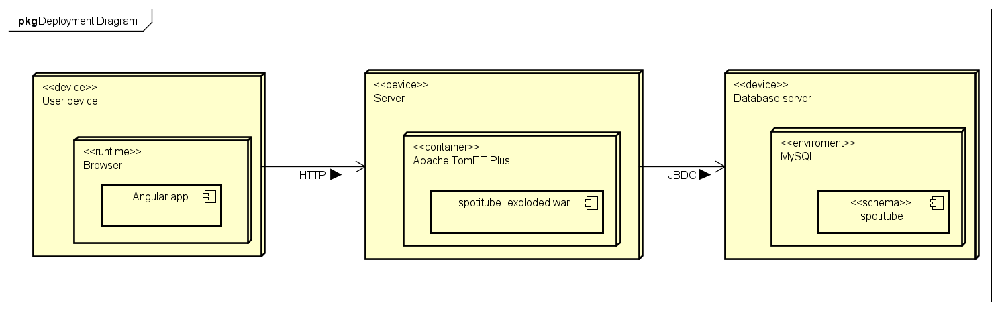
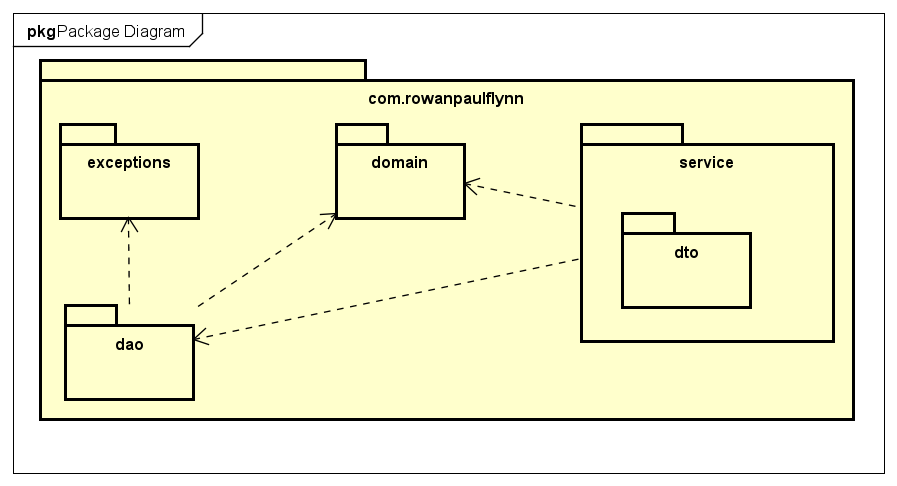

Nederlands onderzoek MongoDB te vinden in de [docs folder](/docs/opleverdocument.pdf).
Nederlands opleverdocument te vinden in de [docs folder](/docs/opleverdocument.pdf).

# OOSE DEA - Spotitube

## Table of contents

<!-- @import "[TOC]" {cmd="toc" depthFrom=2 depthTo=2 orderedList=false} -->

<!-- code_chunk_output -->

- [Table of contents](#table-of-contents)
- [Preface](#preface)
- [Deployment diagram](#deployment-diagram)
- [Package diagram](#package-diagram)
- [Design choices](#design-choices)
- [Conclusie](#conclusie)

<!-- /code_chunk_output -->

## Preface

For the OOSE DEA course I made a JAX-RS API for the already developed Spotitube front-end app. The casus is Spotify and Youtube have joined forces and are working together on an app (Spotitube) that gives a customer an overview of playlists containing audio and video streams. They want to develop part of the back-end first and test it through an existing web application before proceeding with the development of the app.

## Deployment diagram

The application has 3 different devices:

- User device, where the frontend is accessed by the user
- Server for the JavaEE application
- Database server for the MySQL server

To set up the database, you can use the [database.sql](database.sql) file that fills the database with some sample data and sets up all tables properly. The connection to the database is arranged via JDBC by adding the database to the config file of TomEE.

## Package diagram

There are 3 layers: the service layer, the domain layer and the dao layer. All these layers are independent of each other and can be interchanged by other implementations. This has been done, among other things, by dependency injection.

### Service layer

The service layer contains the routes and the DTOs, so this layer appeals to the client. The variables in the dto are directly accessible and intended to be sent/received to and from the client.

### Domain layer

The domain layer contains the classes used in the DAO. These classes have methods and sometimes contain more or different variables than the dto layer.

### DAO layer

The DAO layer contains the connection to the database and retrieves all data from it and sends it to the service layer. The DAO layer currently uses MySQL, but could easily be replaced by a NoSQL DAO.

## Design choices

After logging in, the user receives a token with which routes can be addressed. The token is randomly generated by creating a UUID and putting it, linked to the username, in the database.

There are several custom exceptions in the application, for example to indicate that the user is incorrect. HTTP status codes are used to communicate to the server if something has gone wrong.

## Conclusie

With the help of this file, the code of Spotitube can be better understood and the application can also be set to its own enviroment.
